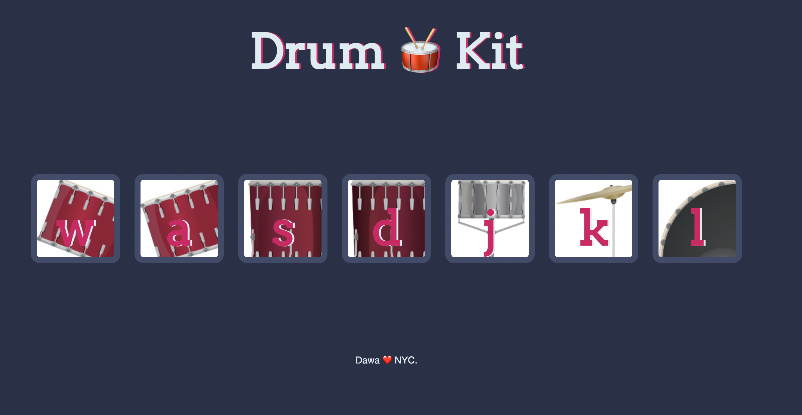

# Drum-Kit
Advanced JS and DOM Manipulation project for the Complete Web Development Bootcamp course by Angela Yu.
The project is used to implement DOM Manipulation and Event Listeners using JS-ES6.

## Deployment

Deployed Website: https://daway101.github.io/Drum-Kit/

## Snapshots:
### Home Page-

## Built With

  * HTML
  * CSS
  * Javascript

## Authors

- LinkedIn - [Dawa Tsering](https://www.linkedin.com/in/dawatsering/)

## Acknowledgments

  * The Complete 2022 Web Development Bootcamp by Angela Yu
